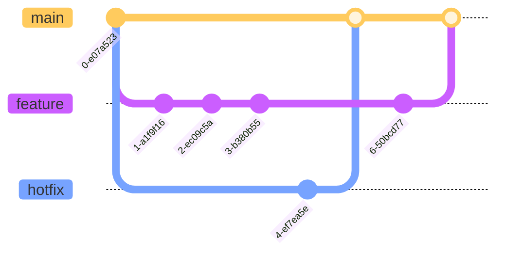

# Monorepo

The `uib-ub-monorepo` is a monorepo for the University of Bergen's fullstack team.

## Branching strategy



## Dependency graph

This graph was generated by Turborepo 25.04.23.


## Setup

```sh
git clone git@github.com:uib-ub/uib-ub-monorepo.git
cd uib-ub-monorepo
```

### Build

To build all apps and packages, run the following command:

```sh
npm run build
```

### Develop

To develop all apps and packages, run the following command:

```sh
npm run dev
```

## Best practice
### Installing packages etc.
Every app's `package.json` is mirrored in the monorepo's shared `package-lock.json` See ([Turborepo docs](https://turbo.build/repo/docs/handbook/package-installation)). This means:
- Changes to `package.json` should be executed with the respective `npm` command and the monorepo's `package-lock.json` has to be updated and commited as well.
- Before creating a new branch (that effects `package-lock.json`) one has to pull from origin. Merging conflicting changes in the shared `package-lock.json` is hard.

## Useful Links

Learn more about the power of Turborepo:

- [Pipelines](https://turborepo.org/docs/core-concepts/pipelines)
- [Caching](https://turborepo.org/docs/core-concepts/caching)
- [Remote Caching](https://turborepo.org/docs/core-concepts/remote-caching)
- [Scoped Tasks](https://turborepo.org/docs/core-concepts/scopes)
- [Configuration Options](https://turborepo.org/docs/reference/configuration)
- [CLI Usage](https://turborepo.org/docs/reference/command-line-reference)