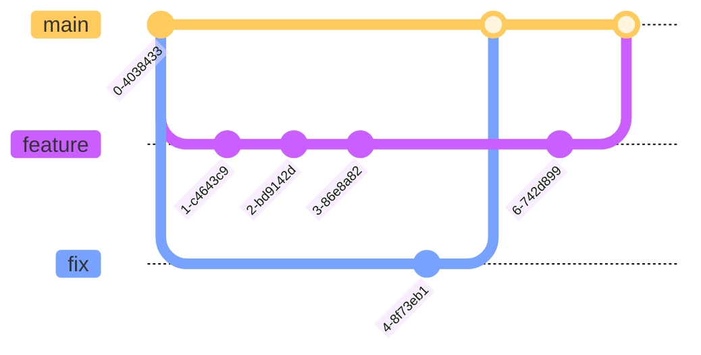

# Monorepo

The `uib-ub-monorepo` is a monorepo for the University of Bergen's fullstack team.

## Getting started

```sh
git clone git@github.com:uib-ub/uib-ub-monorepo.git
cd uib-ub-monorepo
npm install
# build all apps and packages
npm run build
```

### Develop

Start all or just some apps and packages when developing.

```sh
npm run dev
# Or use turbo for filtering of apps
turbo run dev --filter="chc-*" --filter="api" --filter="docs"
```

## Best practice

### Installing packages etc.

Every app's `package.json` is mirrored in the monorepo's shared `package-lock.json` See ([Turborepo docs](https://turbo.build/repo/docs/handbook/package-installation)). This means:

- Changes to `package.json` should be executed with the respective `npm` command and the monorepo's `package-lock.json` has to be updated and commited as well.
- Before creating a new branch (that effects `package-lock.json`) one has to pull from origin. Merging conflicting changes in the shared `package-lock.json` is hard.

Common `npm` commands: 

- npm install
- npm install \<package\> – Add package to root (mainly for devDependencies)
- npm install \<package\> --workspace=\<workspace\>
- npm install \<package\> -w \<workspace\>
- npm uninstall \<package\> --workspace=\<workspace\>
- npm update \<package\> --workspace=\<workspace\>
- npm run build - Build all packages and apps
- npm run dev - Develop all packages and apps
- npm run lint - Lint all packages
- npm run clean - Clean up all node_modules and dist folders (runs each package's clean script)

### Branch strategy

#### Convention

Branches should be prefixed with `fix` or `feature`, mostly...




#### Ignored Build Step based on branch name

Vercel builds every app when a new branch is created. However, it provides a feature to ignore apps based on some logic: [Vercel docs](https://vercel.com/guides/how-do-i-use-the-ignored-build-step-field-on-vercel)

We currently have the following behaviour configured in each app's **Vercel settings**: `Git>Ignored Build Step>Command`:
Every app can define tags of the form `#docs` (docs), `#sps`, (group språksamlingane) `#tp` (termportalen) etc.
Apps that don't include this command are always build.

```bash
if [[ "$VERCEL_GIT_COMMIT_REF" =~ .*#.* ]] && ! [[ "$VERCEL_GIT_COMMIT_REF" =~ .*#(docs).* ]] ;
then
	echo "- Tag not matched, build cancelled"; exit 0;
else
	echo ""- Build can proceed, calling turbo-ignore""; npx turbo-ignore;
fi
```

Behaviour:
- If no tag is present, i.e. no `#` is found in the branch name, no build is cancelled at this step
- If a tag is defined in the branch name, building apps that don't have the tag is cancelled
- `npx turbo-ignore` is called. See [docs](https://www.npmjs.com/package/turbo-ignore)

Tags currently defined are:

* **api**: `#api`
  - Vercel project: **api-ub**
* **chc-exh-nt-web**: `#exh`
  - Vercel project: **exh-nt**
* **chc-web**: `#chc`
  - Vercel project: **chc-web**
* **docs**: `#docs`
  - Vercel project: **docs**
* **link-shortener**: `#urls`
  - Vercel project: **ub-urls**
* **sps-ordbokene-web**: `#sps` `#ob`
  - Vercel project: **ordbokene-web**
* **sps-termportal-web**: `#sps` `#tp`
  - Vercel project: **termportalen**


## Dependency graph

This graph was generated by Turborepo 25.04.23.


## Useful Links

Learn more about the power of Turborepo:

- [Pipelines](https://turborepo.org/docs/core-concepts/pipelines)
- [Caching](https://turborepo.org/docs/core-concepts/caching)
- [Remote Caching](https://turborepo.org/docs/core-concepts/remote-caching)
- [Scoped Tasks](https://turborepo.org/docs/core-concepts/scopes)
- [Configuration Options](https://turborepo.org/docs/reference/configuration)
- [CLI Usage](https://turborepo.org/docs/reference/command-line-reference)