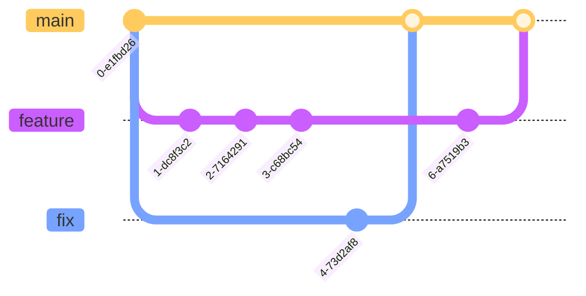

# Monorepo

`uib-ub-monorepo` er et monorepo for Universitetet i Bergens fullstack-team.

## Komme i gang

```sh
git clone git@github.com:uib-ub/uib-ub-monorepo.git
cd uib-ub-monorepo
npm install
# bygg alle apper og pakker
npm run build
```

### Utvikling

Start alle eller bare noen apper og pakker når du utvikler.

```sh
npm run dev
# Eller bruk turbo for filtrering av apper
turbo run dev --filter="chc-*" --filter="api" --filter="docs"
```

## Beste praksis

### Installere pakker etc.

Hver apps `package.json` er speilet i monorepoets delte `package-lock.json`. Se ([Turborepo docs](https://turbo.build/repo/docs/handbook/package-installation)). Dette betyr:

- Endringer i `package.json` bør utføres med den respektive `npm`-kommandoen og monorepoets `package-lock.json` må oppdateres og committes også.
- Før man oppretter en ny branch (som påvirker `package-lock.json`) må man pulle fra origin. Å merge konflikter i den delte `package-lock.json` er vanskelig.

Vanlige `npm`-kommandoer: 

- npm install
- npm install \<package\> – Legg til pakke i root (hovedsakelig for devDependencies)
- npm install \<package\> --workspace=\<workspace\>
- npm install \<package\> -w \<workspace\>
- npm uninstall \<package\> --workspace=\<workspace\>
- npm update \<package\> --workspace=\<workspace\>
- npm run build - Bygg alle pakker og apper
- npm run dev - Utvikle alle pakker og apper
- npm run lint - Lint alle pakker
- npm run clean - Rydd opp i alle node_modules og dist mapper (kjører hver pakkes clean script)

### Branch-strategi

#### Konvensjon

Brancher bør ha prefiks `fix` eller `feature`, for det meste...




#### Ignorert Build Step basert på branch-navn

Vercel bygger hver app når en ny branch opprettes. Men den tilbyr en funksjon for å ignorere apper basert på noe logikk: [Vercel docs](https://vercel.com/guides/how-do-i-use-the-ignored-build-step-field-on-vercel)

Vi har for øyeblikket følgende oppførsel konfigurert i hver apps **Vercel-innstillinger**: `Git>Ignored Build Step>Command`:
Hver app kan definere tags på formen `docs/` (docs), `sps/`, (gruppe språksamlingane) `tp/` (termportalen) etc.
Apper som ikke inkluderer denne kommandoen bygges alltid.

```bash
if [[ "$VERCEL_GIT_COMMIT_REF" =~ .*/.* ]] && ! [[ "$VERCEL_GIT_COMMIT_REF" =~ .*(docs)/.* ]] ;
then
	echo "- Tag not matched, build cancelled"; exit 0;
else
	echo ""- Build can proceed, calling turbo-ignore""; npx turbo-ignore;
fi
```

Oppførsel:
- Hvis ingen skråstrek er til stede, blir ingen build kansellert på dette trinnet
- Hvis en tag er definert i branch-navnet, blir bygging av apper som ikke har taggen kansellert
- `npx turbo-ignore` kalles. Se [docs](https://www.npmjs.com/package/turbo-ignore)

Tags som for øyeblikket er definert er:

* **api**: `api/`
  - Vercel-prosjekt: **api-ub**
* **chc-exh-nt-web**: `exh/`
  - Vercel-prosjekt: **exh-nt**
* **chc-web**: `chc/`
  - Vercel-prosjekt: **chc-web**
* **docs**: `docs/`
  - Vercel-prosjekt: **docs**
* **link-shortener**: `urls/`
  - Vercel-prosjekt: **ub-urls**
* **sps-termportal-web**: `/sps` `tp/` `tpw/`
  - Vercel-prosjekt: **termportalen**
* **sps-termportal-admin**: `sps/` `tp/` `tpa/`
  - Vercel-prosjekt: **termportalen-admin**
* **ub-dashboard**: `ubdash/`
  - Vercel-prosjekt: **ub-dashboard**
* **sps-stadnamn-web**: `sps/` `stadnamn/`
  - Vercel-prosjekt: **stadnamn-web**

## Avhengighetsgraf

Denne grafen ble generert av Turborepo 25.04.23.


## Nyttige lenker

Lær mer om kraften i Turborepo:

- [Pipelines](https://turborepo.org/docs/core-concepts/pipelines)
- [Caching](https://turborepo.org/docs/core-concepts/caching)
- [Remote Caching](https://turborepo.org/docs/core-concepts/remote-caching)
- [Scoped Tasks](https://turborepo.org/docs/core-concepts/scopes)
- [Configuration Options](https://turborepo.org/docs/reference/configuration)
- [CLI Usage](https://turborepo.org/docs/reference/command-line-reference) 